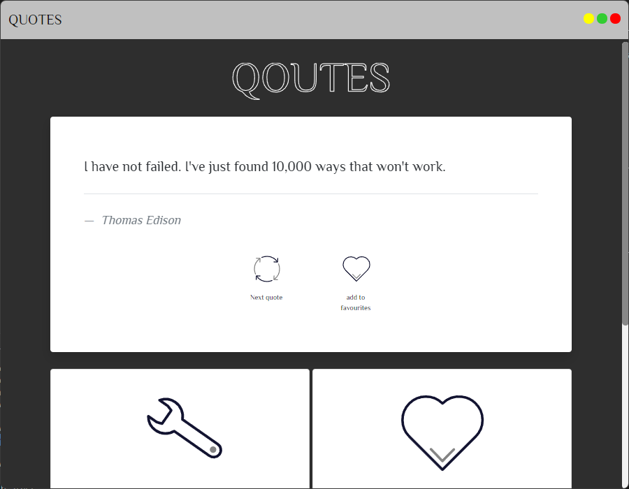

# Desktop Application Quotes

this is an opensource project for a quotes app that gives you motivational quotes in an windows application and runs in system tray with favourting feature.

_NOTE: for developers who want to run this application all localy, you need to clone the backend repo:[https://github.com/SarbandAkray/quotes-backend](https://github.com/SarbandAkray/quotes-backend) and make sure to change the backend url link in the index.js after you run the backend app_

## preview of the application

## installation process (normal user)

1. download the app from this link [quotes.sarband.online](https://quotes.sarband.online)
2. run the setup file

## installation process (developer)

### requirements:

1. node js
2. npm

### installation:

1. clone the repo: `git clone https://github.com/SarbandAkray/QuotesApp`
2. cd to the folder: `cd QUOTESAPP`
3. install required packages: `npm install`
4. run the project: `npm start`

**_feel free to contribute to the open source project for additional features_**
